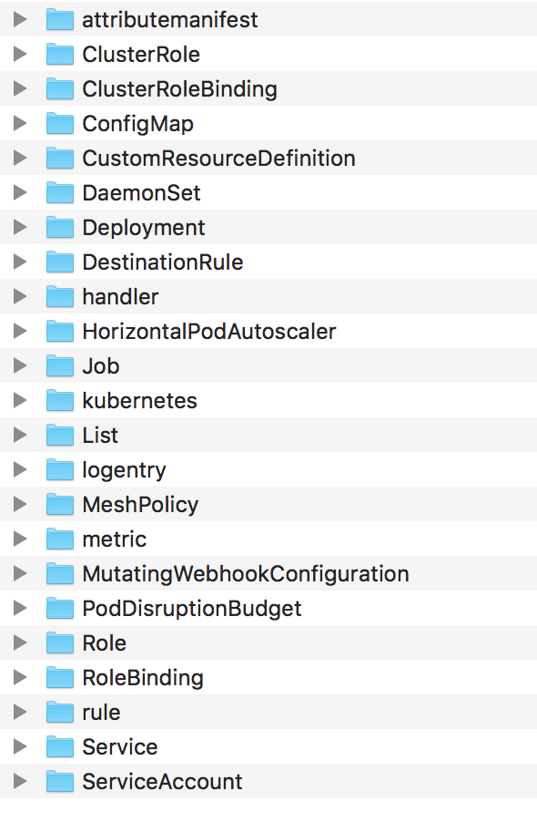

# k8s-yaml-parser

Utility built in GO to parse the k8s resource yaml. K8s resource yaml can be really big and be difficult to read. For example the istio
deployment yaml is 19000 lines. It is difficult to see the resources that are created. This utility does the following

1. Parses the yaml, looks for "---" delimiter and splits the yaml
2. Creates separate yaml file for each resources
3. Organize the yaml files based on the resource kind



## usage
```
file_path=/tmp/istio.yaml dir=/tmp/splitfiles k8s-yaml-parser
```
